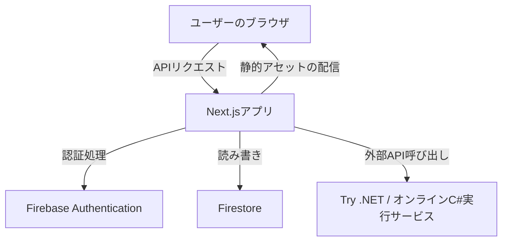

# 1. システム概要

**目的:**  
小学校低学年〜高学年向けに、Unity と C#の基礎知識から、最終的に自己制作が可能なレベルまでを体系的に学習できる Web アプリを構築する。  
**主な機能:**

- テキストとインタラクティブなチュートリアルによる教材の提供
- 生徒ごとのアカウント管理および進捗管理（Firebase Authentication と Cloud Firestore を利用）
- ブラウザ上での C#コード編集・実行環境（Try .NET などを埋め込み）
- ゲーミフィケーション要素を活用した学習のモチベーション維持

---

# 2. システム構成

## 2.1 フロントエンド

- **フレームワーク:** Next.js（React ベース）
- **言語:** TypeScript
- **UI/UX:**
  - 小学生が直感的に操作できるシンプル＆カラフルなデザイン
  - モバイル、タブレット、PC に対応するレスポンシブデザイン（Tailwind CSS 等を採用）
  - コンポーネント例：
    - ヘッダー／フッター／ナビゲーションバー
    - レッスン表示コンポーネント（テキスト、画像、動画付き）
    - コードエディタ／クイズ・インタラクティブチュートリアルコンポーネント
    - 進捗ダッシュボード（ユーザーの達成状況、チェック済みレッスン一覧）

## 2.2 バックエンド／データストア

- **ユーザー認証:** Firebase Authentication
  - メールアドレス、Google 認証など安全な認証方法を選択
- **データ保存:** Firebase Cloud Firestore
  - ユーザーごとに学習進捗、完了レッスン、獲得バッジ等を管理
  - リアルタイムデータの表示やグラフ表示に活用
- **API Routes:**
  - Next.js のサーバーレス API Routes で、必要に応じたサーバ側の制御（例：教材の編集、管理者権限処理など）

## 2.3 インタラクティブコード実行環境

- **技術:**
  - **Try .NET の埋め込み**または、オンラインコンパイラ（JDoodle、Judge0 など）を利用
  - **用途:** ブラウザ上で C#コードの編集、実行、出力結果の確認
- **注意点:**
  - Unity 固有の API（UnityEngine など）は実行環境では再現が難しいため、基礎文法や簡易なコンソール出力レベルの実行に限定
  - 視覚的動作に関しては、事前に用意した GIF や動画、もしくは Unity WebGL ビルドのデモを補助資料として掲載

---

# 3. 機能要件

## 3.1 ユーザー管理

- **新規登録/ログイン:**
  - Firebase Authentication によりシンプルな登録・ログインフォームを実装
  - ログイン状態の監視、認証済みユーザーのみが教材ページにアクセスできるよう制御
- **ユーザープロフィール:**
  - ユーザーの基本情報（名前、メール、進捗データなど）を Firestore に格納
  - ダッシュボードにて学習進捗や獲得バッジ、履歴の表示

## 3.2 教材提供

- **レッスン設計:**  
  各レッスンは下記のセクションから構成
  - **概要:** レッスンの目的や内容を平易な言葉で解説
  - **理論部分:** Unity と C#の基本文法、概念（変数、条件分岐、ループ等）の解説
  - **実践部分:** コード例、実際に手を動かして学ぶインタラクティブセクション（コードエディタ・実行環境組み込み）
  - **確認・クイズ:** 簡単な問題や穴埋め形式で理解度チェック
- **教材フォーマット:**
  - Markdown（もしくは MDX）ベースでテキスト・画像・動画を組み合わせたコンテンツを作成
  - ページ毎に進捗が保存され、完了したレッスンはチェックマークを表示

## 3.3 インタラクティブ機能

- **C#コードエディタ:**
  - Monaco Editor や Try .NET のウィジェットを使用
  - コード入力、実行ボタン、実行結果エリアの表示
- **クイズ／ヒント機能:**
  - 各レッスンの最後にインタラクティブクイズを実装
  - ユーザーが正解した場合、次レッスンへの案内やバッジの獲得をトリガー
- **フィードバック:**
  - 回答やコード実行の結果に対して、即時フィードバックを提供
  - ユーザー毎の学習履歴として Firestore へ保存

## 3.4 ゲーミフィケーション

- **バッジ・レベル:**
  - レッスン完了、連続ログイン、特定のチャレンジ達成などに基づきバッジや称号を付与
- **進捗ダッシュボード:**
  - ユーザーの全レッスンの達成状況、スコア、レベルを可視化するインターフェースを設計
- **通知機能:**
  - Firebase Functions 等で特定の条件（例：全レッスン完了時）をトリガーに、励ましや達成報告の通知を送信

---

# 4. 非機能要件

- **パフォーマンス:**
  - 初回ロード時間の最小化を図るため、Lazy Loading・コードスプリッティングを導入
  - リアルタイム更新が必要な部分（進捗ダッシュボードなど）は Firestore のリスナーを活用
- **セキュリティ:**
  - Firebase Authentication と Firestore のセキュリティルールによるユーザー認証とデータアクセス制御
  - API Routes では必要に応じて認証トークンの検証を実施し、不正アクセスを防止
  - インタラクティブ実行環境では、サンドボックス化された安全な環境でコードを実行（タイムアウトやリソース制限の実装）
- **拡張性:**
  - コンポーネントベースの設計により、将来的な新機能（例：新たな教材コンテンツやインタラクティブ機能）の追加を容易にする
  - Firebase および Next.js のサーバーレス環境は、トラフィックの増加に自動でスケールできる設計を検討

---

# 5. システムアーキテクチャ・データフロー

## 5.1 ハイレベルアーキテクチャ

- **ユーザー操作:**  
  ブラウザ上で、ログイン後に教材ページへアクセス。教材ごとにコンテンツを Next.js 側でレンダリングし、ユーザー進捗は Firestore に記録。
- **認証とデータ保存:**  
  Next.js アプリ内で Firebase Authentication で認証状態を管理、Firestore へ学習進捗やユーザー設定を保存。
- **コード実行:**  
  インタラクティブコンポーネントから、Try .NET や Judge0 API などへのリクエストを送信し、C#コードの実行結果を受信・表示。

## 5.2 データモデル例

### ユーザードキュメント（Firestore コレクション `users`）

- `uid`: Firebase Authentication のユーザー ID
- `name`: ユーザー名
- `email`: メールアドレス
- `progress`: オブジェクト形式で各レッスン ID とその完了状況、得点など
- `badges`: 獲得したバッジ情報（配列またはオブジェクト形式）
- `createdAt`/`updatedAt`: タイムスタンプ

### レッスンコンテンツドキュメント（Firestore コレクション `lessons`）

- `lessonId`: レッスン ID（各レッスンのユニーク識別子）
- `title`: レッスンタイトル
- `content`: Markdown/MDX 形式で記述された教材コンテンツ
- `quiz`: クイズの問題文、選択肢、正解情報など
- `order`: レッスンの順序情報

---

# 6. 開発スケジュールとフェーズ

## 6.1 フェーズ 1: 要件定義・プロトタイプ作成

- **基本画面設計:** ログイン／教材一覧／個別レッスンページ／進捗ダッシュボードのワイヤーフレーム作成
- **Firebase 連携:** Authentication および Firestore の初期設定・簡易データモデルの構築
- **インタラクティブエディタ:** Try .NET（またはオンライン API 経由）の簡単な埋め込みデモ構築

## 6.2 フェーズ 2: 開発と実装

- **フロントエンド:** Next.js で主要 UI コンポーネント、レスポンシブ対応の実装
- **バックエンド:** Firebase および Next.js API Routes による認証・データ保存ロジックの実装
- **学習コンテンツ:** 各レッスンの教材コンテンツ作成、コードサンプル・クイズの実装

## 6.3 フェーズ 3: テスト・調整・公開

- **ユニットテスト・統合テスト:** 各機能（認証、進捗保存、コード実行など）の自動テスト実装
- **UX テスト:** 小学生及び保護者を対象にユーザーテスト実施、フィードバックを反映
- **デプロイ:** Firebase Hosting または Vercel 等により公開。セキュリティルールや実行環境の最終確認

---

# 7. セキュリティとパフォーマンス対策

- **認証・アクセス制御:**
  - Firebase Authentication を利用し、各 API リクエスト時に認証トークンの検証
  - Firestore セキュリティルールの設定により、ユーザーは自身のデータのみにアクセス
- **サンドボックス:**
  - コード実行環境はサンドボックス化し、無限ループや悪意あるコード実行を防止
  - 外部 API 利用時はリクエスト数や実行時間に制限、必要に応じたキャッシュ制御
- **パフォーマンス:**
  - Next.js のサーバサイドレンダリング（SSR）や静的生成（SSG）を有効利用
  - CDN を利用した静的アセットの配信による高速表示
  - クライアントサイドの状態管理により、余分なリクエストを削減

---

# 8. UI/UX デザインガイドライン

- **配色:**
  - 小学生が親しみやすい明るくシンプルな色使い。ボタンやリンクは大きく、視覚的フィードバック（ホバー・クリック時のアニメーション）を実装
- **レイアウト:**
  - モバイルファーストなデザイン。画面の幅に合わせたレイアウトの自動調整
  - 主要コンテンツとナビゲーションの分離。各レッスンはシンプルなカードデザインで一覧表示
- **アクセシビリティ:**
  - フォントサイズ、ボタンのタップ領域、色コントラストの確認
  - マウスオーバーでキーワードの説明（ふりがな等）を表示する機能の検討

---

# 9. 今後の拡張計画

- **高度な演習機能:**
  - ブラウザ上での Unity エンジンの部分的再現、WebGL ビルドのデモ動画の埋め込み
  - 独自のコード実行環境（例えば Blazor WebAssembly を利用した C#実行）の検討
- **コンテンツ更新:**
  - 管理者向けの教材編集 UI（Next.js の API Routes と Firebase Admin SDK を活用）
  - 学習者のフィードバックをもとに、定期的なコンテンツのアップデート

---

# 10. まとめ

本設計書は、Next.js と TypeScript をベースとした小学生向け Unity 学習 Web アプリの全体像を示すものです。

- **システムは、シンプルかつ親しみやすい UI でユーザーが自分の進捗を確認しながら、テキストとインタラクティブな演習で C#と Unity の基礎を習得できる設計です。**
- **Firebase を活用した認証とデータ管理、Try .NET などの技術により、実践的な学習体験と安全な環境を両立させることが可能となります。**

これにより、学習者は自信を持って自己制作に挑戦でき、将来的な応用力の獲得を目指します。
